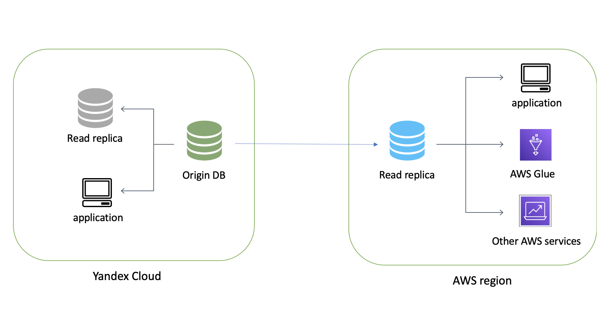

# Setting up replication between AWS RDS PostgreSQL and Yandex Managed Database

## Overview and target scenario 
We see more and more customers are looking for aproaches that could help build their hybrid solutions. It could be local country regulations or latency requeremnts, the others using AWS as primary deployment and consolidating data there. To help our customers, we tested replication between AWS RDS PostgreSQL ver 12.3 and Managed Service for PostgreSQL ver. 12 and prepared detailed step-by-step instruction for that scenario. [Here](https://www.postgresql.org/docs/10/logical-replication.html) is the official documentation for logical replication in PostgreSQL wich is used to create that solution.  Below you can see deployment architecture. 




You can find the detailed description how is similar proccess is working between PostgreSQL instances deployed on AWS, [here](https://aws.amazon.com/blogs/database/using-logical-replication-to-replicate-managed-amazon-rds-for-postgresql-and-amazon-aurora-to-self-managed-postgresql/). The proccess consits of two stages:
1. Initial setup of logical replication slot and initial copy of data
2. Establishing on-going replication of changes using `pgoutput` plugin  

## Prerequisites

1. Deploy new RDS database instance in your AWS account. You can find detailed insutruction [here](https://docs.aws.amazon.com/AmazonRDS/latest/UserGuide/CHAP_GettingStarted.CreatingConnecting.PostgreSQL.html) 
`Note: You need to setup public access for the host.`
2. Deploy new Yandex Managed Service for PostgreSQL also you can use your current deployment. You can find detailed insutrction how to deploy it [here](https://cloud.yandex.ru/docs/managed-postgresql/quickstart)  
`Note: You need to setup public access for the host.`
3. Configure security group for RDS instance to allow inbound and outbound traffic from IP yandex managed database host address. Ip address could be resolved using hostname from connection string provided in yandex web-console. 
For example: `port:5432, ip:84.201.177.214/32, protocol:TCP`

## Configuring replication

### Yandex Database
1. You need to grant permissions for the user that will be used for replication. To do that you need to execute that command using Yandex CLI:

```
yc managed-postgresql user update {user_name} --grants mdb_replication --cluster-id {cluster_id}
```

2. Create a test table:

```
CREATE TABLE phone(phone VARCHAR(32), firstname VARCHAR(32), lastname VARCHAR(32);
```

3. Insert test data:

```
INSERT INTO phone(phone, firstname, lastname) VALUES ('12313213', 'Jack', 'Jackinson')
```

4. Create publication:

```
CREATE PUBLICATION yandex_pub FOR TABLE phone;
```


### AWS RDS for PostgreSQL
1. You need create a new `Parameters group` and set value - "1" to parameter `rds.logical_replication` and attach it to your database instance. You can find detailed instruction how to create Parameters Group [here](https://docs.aws.amazon.com/AmazonRDS/latest/UserGuide/USER_WorkingWithParamGroups.html).
2. To establish replication you need to have same tables on read replica instance. For that you can use pgdump and restore or in our example just create the same empty table:
```
CREATE TABLE phone(phone VARCHAR(32), firstname VARCHAR(32), lastname VARCHAR(32);
```
3. Create subscription to the changes on origin database using your user credentials:
```
СREATE SUBSCRIPTION yandex_sub CONNECTION 'host=rc1b-ic8pnpo734nleelq.mdb.yandexcloud.net port=6432 dbname=db1 user={xxxx} password={xxxxxxx}' PUBLICATION yandex_pub;
```

### Testing replication
1. After succesfully finished above steps you should see the initial data on you AWS read replica instance. Try to execute that command on AWS read replica instance:
`select * from phone` You should see the initial data from your origin Yandex database. Now all changes on the data from origin will be replicated to read replica in AWS. 
2. Try to insert new row in origin database like that and check changes on read replica after that.:
```
INSERT INTO phone(phone, firstname, lastname) VALUES ('444444, 'Alex', 'Trump')
```

Also, you can check the status of replication slots on origin database using that query: `select * from pg_replication_slots;` that should return something similar to that: 

slot_name |  plugin  | slot_type | datoid | database | temporary | active | active_pid | xmin | catalog_xmin | restart_lsn | confirmed_flush_lsn 
-----------|----------|-----------|--------|----------|-----------|--------|------------|------|--------------|-------------|---------------------
 mysub     | pgoutput | logical   |  13934 | postgres | f         | t      |      31772 |      |          661 | 0/12016490  | 0/120164C8


Using that command in query can help you with current progress and get replication statistic: `select * from pg_stat_replication;`

### Replication of all tables
1. To replicate all tables in your databse you need to have similar schemas of tables in both databases. The easiest way to use `pg_dump --schema-only.` command and appply that on read replica instance.  
2. After that you need to create Publication: `CREATE PUBLICATION yandex_pub FOR ALL TABLES`
3. Then the proccess is the same from above instruction. 

### Limitations
You can find more details about replication restrictions and limitation [here](https://www.postgresql.org/docs/10/logical-replication-restrictions.html). Main restrictions are:
* The database schema and DDL commands are not replicated. The initial schema can be copied by hand using pg_dump --schema-only. Subsequent schema changes would need to be kept in sync manually. (Note, however, that there is no need for the schemas to be absolutely the same on both sides.) Logical replication is robust when schema definitions change in a live database: When the schema is changed on the publisher and replicated data starts arriving at the subscriber but does not fit into the table schema, replication will error until the schema is updated. In many cases, intermittent errors can be avoided by applying additive schema changes to the subscriber first.
* Sequence data is not replicated. The data in serial or identity columns backed by sequences will of course be replicated as part of the table, but the sequence itself would still show the start value on the subscriber. If the subscriber is used as a read-only database, then this should typically not be a problem. If, however, some kind of switchover or failover to the subscriber database is intended, then the sequences would need to be updated to the latest values, either by copying the current data from the publisher (perhaps using pg_dump) or by determining a sufficiently high value from the tables themselves.
* TRUNCATE commands are not replicated. This can, of course, be worked around by using DELETE instead. To avoid accidental TRUNCATE invocations, you can revoke the TRUNCATE privilege from tables.
* Large objects (see Chapter 34) are not replicated. There is no workaround for that, other than storing data in normal tables.
* Replication is only possible from base tables to base tables. That is, the tables on the publication and on the subscription side must be normal tables, not views, materialized views, partition root tables, or foreign tables. In the case of partitions, you can therefore replicate a partition hierarchy one-to-one, but you cannot currently replicate to a differently partitioned setup. Attempts to replicate tables other than base tables will result in an error.

### Using AWS Database Migration Service
Current version of AWS Database Migration Service is using `pglogical` extension to sync the data between PostgreSQL databases. Unfortunatly, Yandex Managed Database for PostgreSQL does not have that extension. Therefore you can't establish on-going replication but still can use that service for one-time migration purposes. [Here](https://docs.aws.amazon.com/dms/latest/userguide/CHAP_SettingUp.html), you can find detailed instruction how to use AWS Database Migration Service for establish replication between PostgreSQL database.   