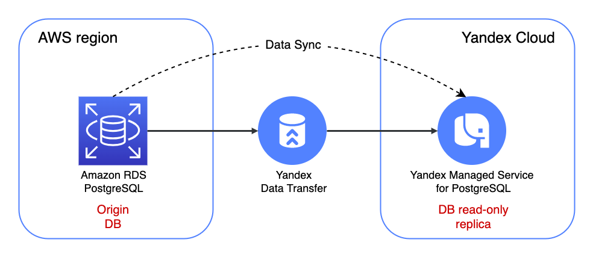

# Setting up data replication between AWS RDS for PostgreSQL and Yandex Managed Database for PostgreSQL by Yandex Data Transfer

## Overview and target scenario
We’ve noticed that more and more customers are looking for approaches to help them build hybrid solutions. While the reasons for this include a need to comply with local regulations and meet latency requirements, others use AWS for primary deployment and consolidating data. To help our customers, we tested data replication (sync) between `AWS RDS for PostgreSQL` (version 13) and `Yandex Cloud Managed Service for PostgreSQL` (version 13) and prepared detailed step-by-step instructions for the scenario. For the data transfer is used `Yandex Data Transfer` service. The deployment architecture is illustrated below:

<p align="center">
    
</p>

## Documentation
* [Amazon RDS for PostgreSQL](https://aws.amazon.com/rds/postgresql/)
* [Yandex Managed Service for PostgreSQL](https://cloud.yandex.com/en/docs/managed-postgresql/)
* [Yandex Data Transfer](https://cloud.yandex.com/en/docs/data-transfer/)


## Prerequisites

- Accounts in AWS and Yandex Cloud
- Bash
- Terraform 1.1.5
- jq
- [PostgreSQL Client (psql)](https://www.compose.com/articles/postgresql-tips-installing-the-postgresql-client/)

To configure AWS site:
- Configure [AWS CLI](https://docs.aws.amazon.com/cli/latest/userguide/cli-chap-configure.html)

To configure Yandex Cloud site:
- Configure [YC CLI](https://cloud.yandex.com/docs/cli/quickstart) 
- Export Yandex Cloud Credentials for Provider
```
export YC_TOKEN=$(yc config get token)
export YC_CLOUD_ID=$(yc config get cloud-id)
export YC_FOLDER_ID=$(yc config get folder-id)
```

## Quick start

### Initiate example playbook

This playbook will create PostgreSQL instances on AWS and YC sides.

Please wait for about 10 minutes when tasks have been finished.

```
cd example
terraform init
terraform apply 
```

### Prepare an environment
```bash
DB_USER=$(terraform output -raw db_user)
DB_PORT=$(terraform output -raw db_port)
DB_NAME=$(terraform output -raw db_name)
DB_PASS=$(terraform output -raw db_passwd)

YC_DB_ID=$(terraform output -raw yc_db_cluster_id)
YC_DB_HOST=$(terraform output -raw yc_db_host_fqdn)

AWS_DB_HOST=$(terraform output -raw aws_db_host_fqdn)
```

### Create table with the sample of data in Origin DB (AWS side)
```bash
psql "postgresql://$DB_USER:$DB_PASS@$AWS_DB_HOST:$DB_PORT/$DB_NAME" -c "CREATE TABLE phone (phone VARCHAR(32) PRIMARY KEY, firstname VARCHAR(32), lastname VARCHAR(32)); INSERT INTO phone (phone, firstname, lastname) VALUES('12313213','Jack','Jackinson');"
```

### Create Yandex Data Transfer for the data replication
Create the Yandex Data Transfer for replicate data from the AWS to Yandex Cloud
```bash
terraform apply -var=dt_enable=true
```
Please wait about 10 minutes when tasks have been finished.

### Check data replication results on YC side
```bash
psql "postgresql://$DB_USER:$DB_PASS@$YC_DB_HOST:$DB_PORT/$DB_NAME" -c "SELECT * FROM phone;"
```

### Add more data to the Origin DB  AWS side
```bash
psql "postgresql://$DB_USER:$DB_PASS@$AWS_DB_HOST:$DB_PORT/$DB_NAME" -c "INSERT INTO phone(phone, firstname, lastname) VALUES ('444444','Alex','Trump');"
```
Data transfer can take a few minutes!

### Check data replication results again on YC side
```bash
psql "postgresql://$DB_USER:$DB_PASS@$YC_DB_HOST:$DB_PORT/$DB_NAME" -c "SELECT * FROM phone;"
```

### To destroy everything quickly

Destroy the Yandex Data Transfer resource first.
```bash
terraform destroy -target=yandex_datatransfer_transfer.dt_transfer
```

Please wait about 5 minutes when previous destroy task has been finished and destroy all other resources.

```
terraform destroy
```
