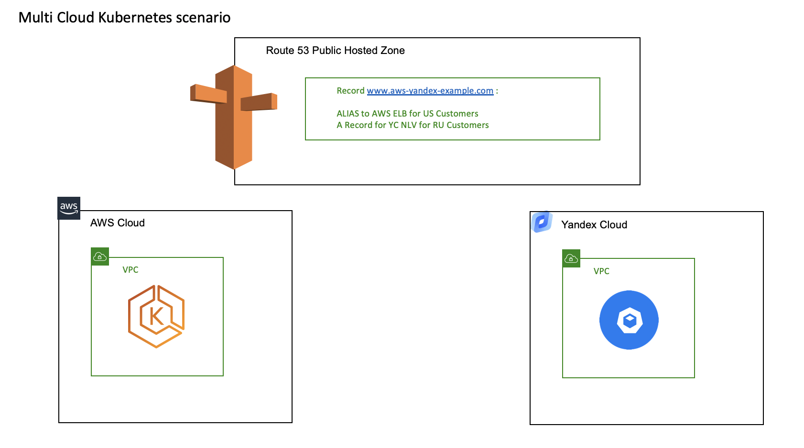

## Overview and target scenario 
This scenario specifically targets customers who have chosen Kubernetes as their base PaaS technology. This customers could have users for their application that are located in locations where AWS doesn't have its data centers ( like Russia )
As a Solution this users can deploy satellite Kubernetes Cluster in Yandex.Cloud and add services from this clusters to Global service management system.

For example in this solution you can have a Main application installed in AWS and satellite application installed in Yandex.Cloud. Both applications use Route53 with Regional Forwarding that forward requests from US to US site and Russian requests to Russian site.





You can add other solutions from this library - for example 
- vpn solution could help you to create secure channels between sites
- RDS or AWS replication scenarios to help you sync your data
- Kubefed to federate Kubernetes control plane


## Prerequisites

- Accounts in AWS and Yandex.Cloud
- Terraform 
- jq

To configre AWS Site
- Configure AWS CLI 
- install [AWS iam authenticator](https://docs.aws.amazon.com/eks/latest/userguide/install-aws-iam-authenticator.html)

To configure Yandex.Cloud part
- Configure  [YC CLI](https://cloud.yandex.com/docs/cli/quickstart) 
- Export Yandex Cloud Credentials for Provider

```
export YC_TOKEN=$(yc config get token)
export YC_CLOUD_ID=$(yc config get cloud-id)
export YC_FOLDER_ID=$(yc resource-manager folder get --name=default --format=json | jq -r .id)
```
This example uses folder 'default' for Yandex.Cloud , if you want to use another folder pleaase use 


## Quick start


Apply terraform playbook

```sh
terraform init
terraform apply
```

Wait for about 20 minutes 

if you have problems with EKS site please 


1) get aws cluster name
2)configure  cluster credentials and reapply terraform

eg
```
CLUSTER_NAME=aws eks list-clusters | jq -r .clusters[0]
aws eks --region us-west-2 update-kubeconfig --name $CLUSTER_NAME
terraform apply
```

## Check the result


You can curl both pods deployed in multiple clusters

```
curl $(terraform output eks_lb_ip)
curl $(terraform output yc_lb_ip)
```

to check whether route 53 global dns works please 

1) Go to AWS Console 
2) Choose Route53 Service
3) Choose 'aws-yandex-example.com' 
4) Press "Test Connection"

test www record with from different resolver addresses

1) You can Google  address as US resolver 8.8.8.8 
2) You can use Yandex  ip address as RU resolver 87.250.250.1
