# Multi-cloud storage with Yandex.Cloud and Amazon S3

You can use Flexify.IO to transparently distribute data between [Yandex.Cloud Object Storage](https://cloud.yandex.com/services/storage) and [Amazon S3](https://aws.amazon.com/s3/). The following scenarios are supported:

-	Storing a portion of data on Yandex.Cloud while the rest of the data is stored on Amazon S3.
- Caching/offloading a portion of Amazon S3 data to Yandex.Cloud.
- Replicating data between Yandex.Cloud and Amazon S3.
- Migrating data between Amazon S3 and Yandex.Cloud. 
In all scenarios, both Yandex.Cloud and Amazon Web Service virtual machines, as well as other services, have transparent access to all data and within a single namespace.

## Deploying Flexify.IO

We recommend Yandex.Cloud users deploy Flexify.IO from [Yandex.Cloud Marketplace](https://cloud.yandex.com/marketplace/products/f2e8u2ae4uv5ifiip7t3). 

- In the [Yandex.Cloud Console](https://console.cloud.yandex.com/) choose **Create VM** in the Compute Cloud section.
- In the **Image/boot disk** section, select **Cloud Marketplace** and click **Show More**.
- Search for Flexify and select the latest version of Flexify.IO as the base image. 

- Specify the CPU and RAM for the VM based on your projected usage (we recommend at least 2 CPU and 4 GB RAM), your login, and public SSH key. Click **Create VM**.
- Once the VM is up and running, find its public IP address and open it in the browser.
### 
It may take a few minutes for the VM to start. Please wait for the Create account window to appear.
### 
If you choose to connect to the VM over HTTPS, note that the initial SSL certificate will be self-signed and won’t automatically be accepted by most browsers. 

- Create an account with a username or email address and a password. You’ll use this later to sign in to the Flexify.IO instance.

## Adding storage accounts to Flexify.IO

Once you’ve logged in to the Flexify.IO Console, you can add one or more cloud storage accounts. 

To add a storage account, go to the Data tab and click **Add Storage**. The Add Storage Account window will appear. In the dialog box, you can add a storage account from a supported cloud, including Yandex.Cloud, Amazon S3, Azure Blob Storage, and Dell EMC ECS, or on-premise object storage. 

### Adding Yandex.Cloud

To add Yandex.Cloud Object Storage, first generate Yandex.Cloud access keys. 

- In the Yandex.Cloud Console, select a cloud and choose **Service accounts** from the left menu.
- Create a new service account with the **storage.admin** role.
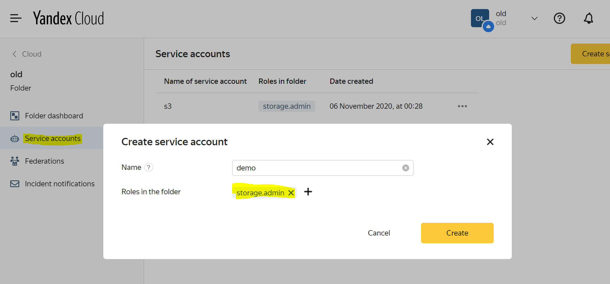

- Select the newly created account, click **Create new key**, and then click **Create static access key**. 

- Copy the key ID and the secret key to the clipboard.  
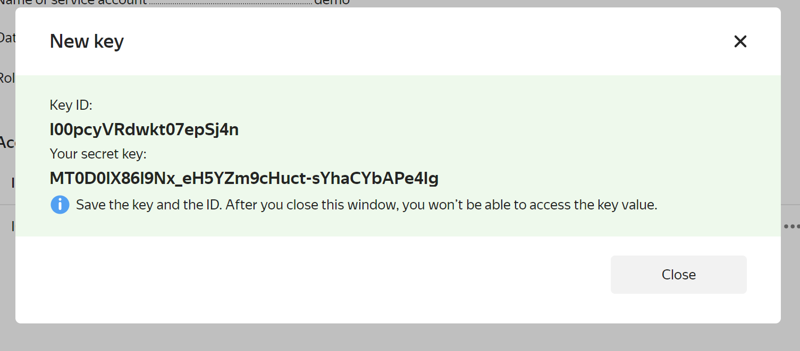

- In the Flexify.IO Console, choose Yandex.Cloud from the **Storage Provider** drop-down list and paste the access keys. 
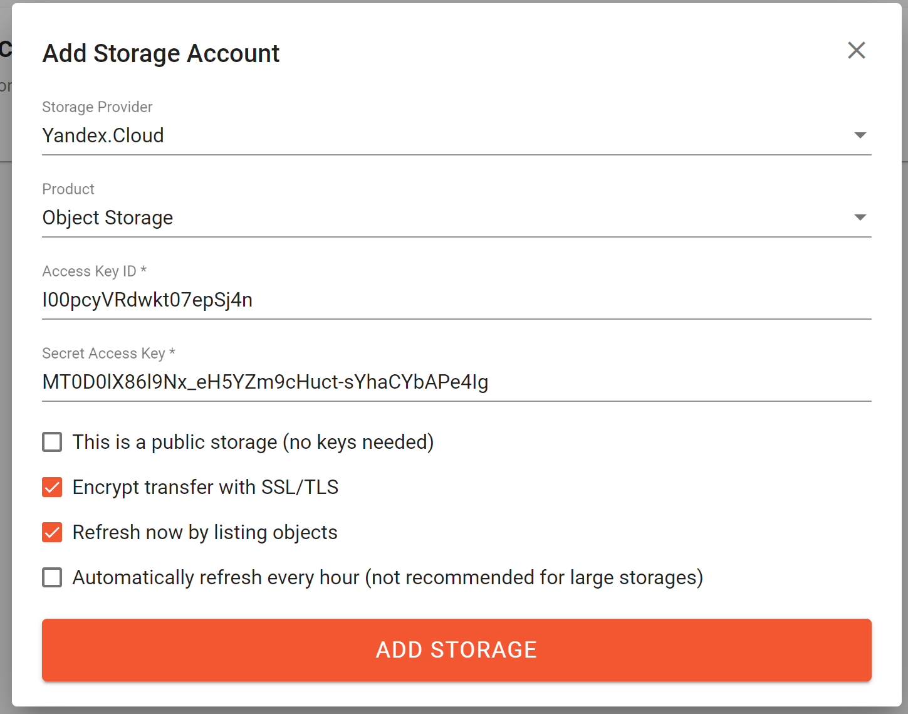

- Click **Add Storage**. This will add the Yandex.Cloud storage account to Flexify.IO and start refreshing buckets to display statistics.
 
### Adding Amazon S3

To add an Amazon S3 storage account to Flexify.IO, you need Amazon S3 keys with permission to access Amazon S3 storage.

- In the Amazon Web Services Console, choose IAM (available at [https://console.aws.amazon.com/iam/home](https://console.aws.amazon.com/iam/home)).
- On the **Users** tab, click **Add user**.
- Specify the username and choose Programmatic access.

- Assign the **AmazonS3FullAccess** policy to the newly created account. 
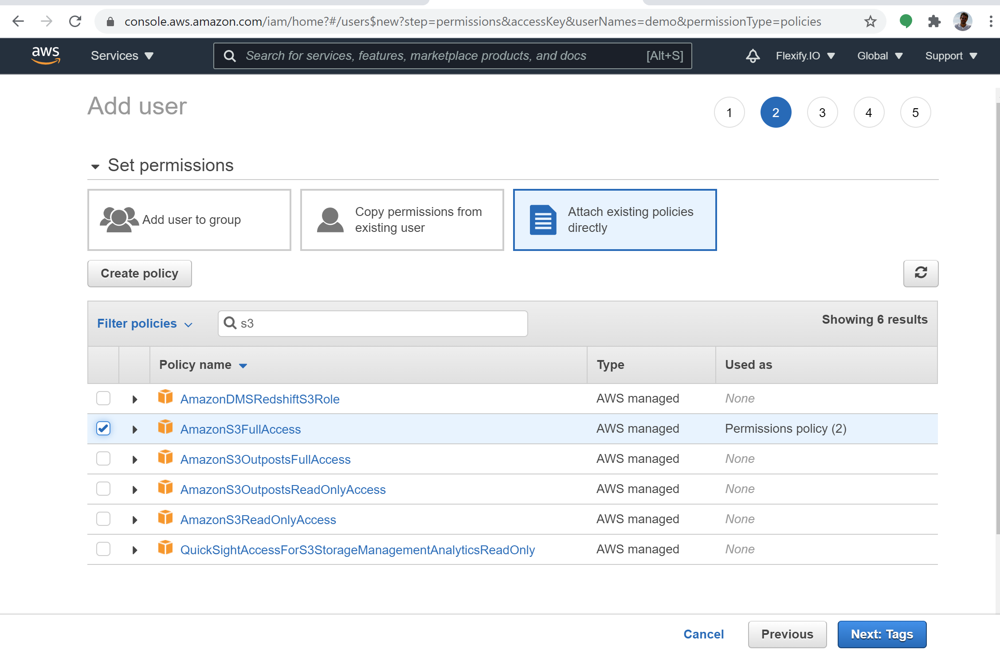
### 
While this is the easiest method, Flexify.IO doesn’t require full Amazon S3 access rights. For an example of an IAM policy that is compatible with Flexify.IO, click **Policy Example** in the **Add Storage Account** window.

-	Once the user is created, copy-paste the Access key ID and the Secret access key. 
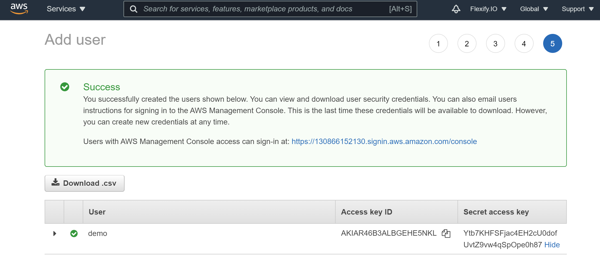

- In the Flexify.IO Console, choose Yandex.Cloud from the **Storage Provider** drop-down list and paste the newly generated access keys.  
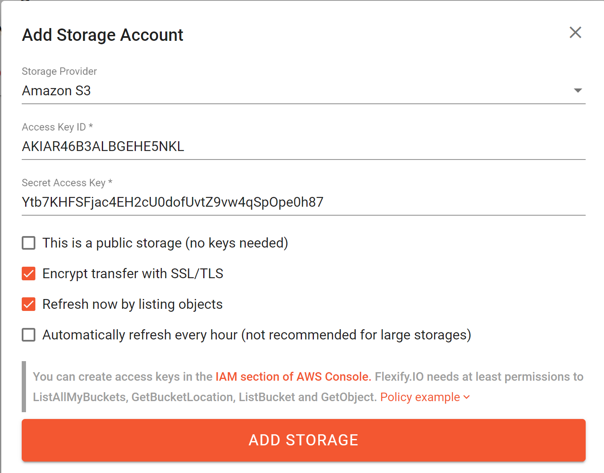

- Click **Add Storage** to add the storage account.

## Migrating data from Amazon S3 to Yandex.Cloud

Once you have added your storage accounts to Flexify.IO, you can copy or transfer data between them. 

- On the **Data** tab, click **Transfer Data** (or click **New Migration** on the **Migrations** tab).
- In the **From** box, select one or more buckets to migrate data from.
- In the **To** box, choose choose Yandex.Cloud Object Storage. You can select any existing bucket or let Flexify.IO create a new one. 
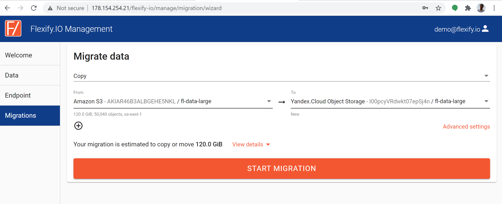

### About bucket names
You can enter any name for a new bucket. However, make sure that the bucket name is globally unique. Even if someone else already has a bucket with the same name, you won’t be able to use it. 

- _Optionally_, click Advanced settings and fine-tune the migration setting. 
- Click Start Migration and monitor the migration progress.
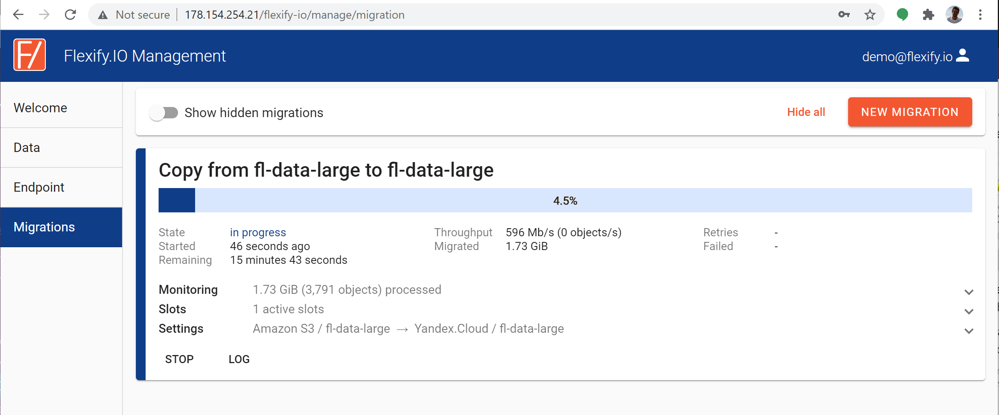

## Combining data from Amazon S3 and Yandex.Cloud

A unique feature of Flexify.IO is its ability to combine data from two or more clouds in a single virtual storage and make it accessible via a unified S3-compatible endpoint. 

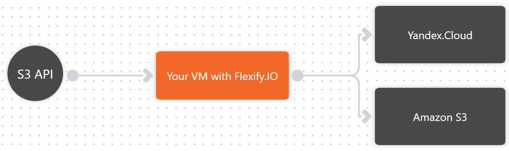
To configure a Flexify.IO virtual endpoint:

- In the Flexify.IO console, go to the **Endpoint** tab.
- If no endpoint has been created yet, click **New Endpoint**.
- Click the (+) sign to attach Yandex.Cloud Object Storage to the virtual endpoint.
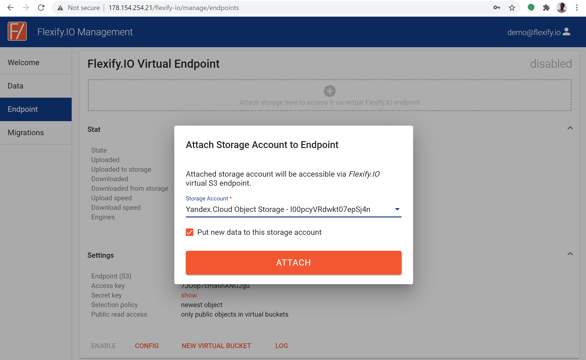

- Click (+) again to attach Amazon S3 storage to the virtual endpoint. 
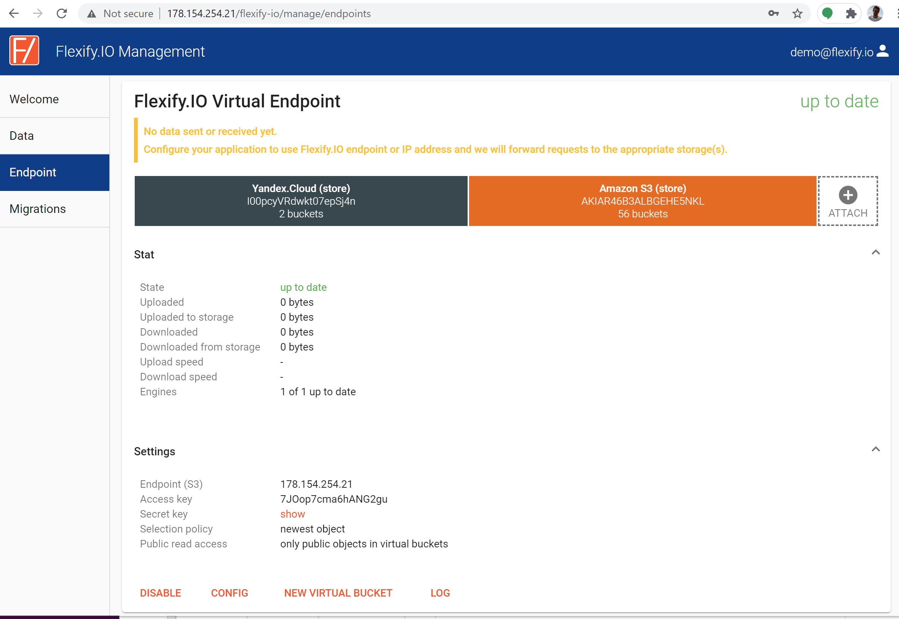
Now all objects from Yandex.Cloud and Amazon S3 are combined and available via the S3-compatible endpoint on your Flexify.IO virtual machine. You’ll need to configure your application to use your machine's IP address (such as 178.154.254.21 in this example) with the access key and the secret key given in the endpoint settings.

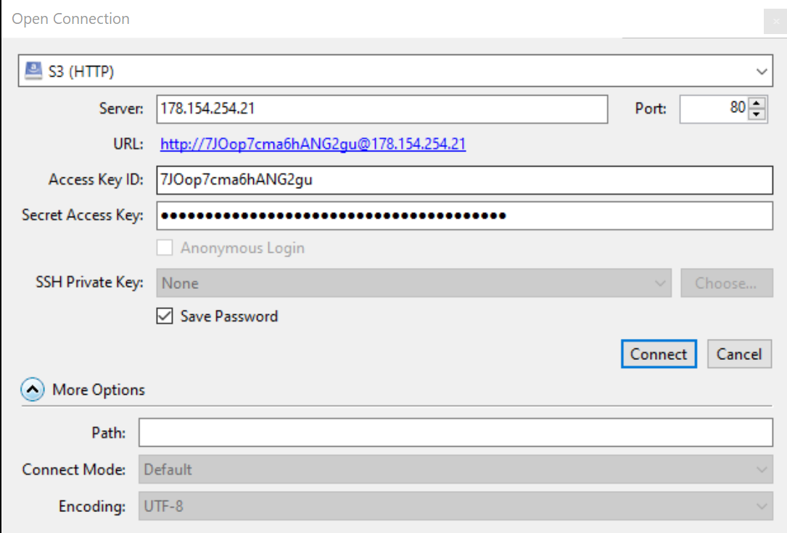

Flexify.IO will accept S3 requests and forward them to all attached storages, combining the results. For example, if you have plane.jpg and ship.jpg in your Amazon S3 account and ship.jpg and train.jpg in your Yandex.Cloud account, all three objects will be combined via the Flexify.IO virtual endpoint: plane.jpg, ship.jpg, and train.jpg.

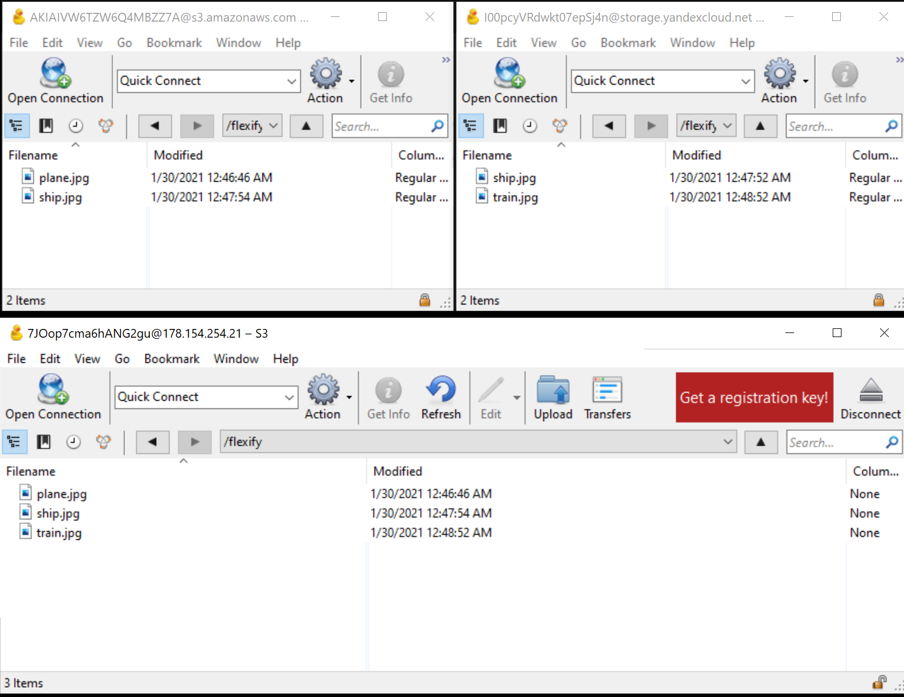

### Read Policy

Imagine that in the example above, Amazon S3 and Yandex.Cloud have different versions of ship.jpg. Which version will the client receive if they request ship.jpg via the virtual endpoint? This is managed by the read policy in the endpoint settings.

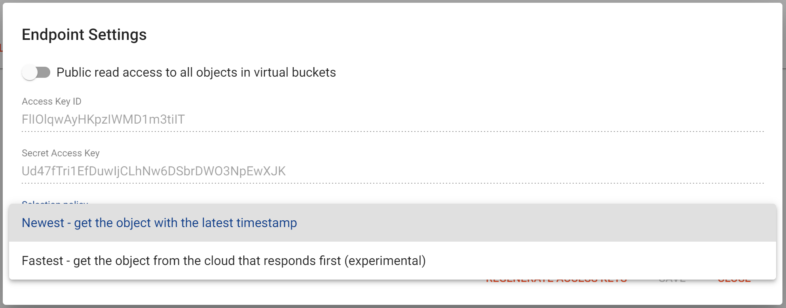

- By default, with the **Newest** policy, Flexify.IO will compare timestamps of objects in Amazon S3 and Yandex.Cloud and choose the latest version. This works best in migration scenarios where you only write new data to Yandex.Cloud, but still need data readily available on Amazon S3. 
- With the **Fastest** policy, Flexify.IO will deliver the version of the object from the cloud that responds first. This works best in scenarios where you have replicas of identical objects in both clouds and want to optimize for the best performance.

### Write Policy

By default, Flexify.IO will replicate all data written via the virtual endpoint across all attached storages: in this case, both Yandex.Cloud and Amazon S3. 

You may only want to save new data to Yandex.Cloud, while keeping data still in Amazon S3 visible and accessible. To do this, disable writing data to Amazon S3 by clicking the **Amazon S3 account** on the storage bar and removing the check mark next to **Put new data here**.

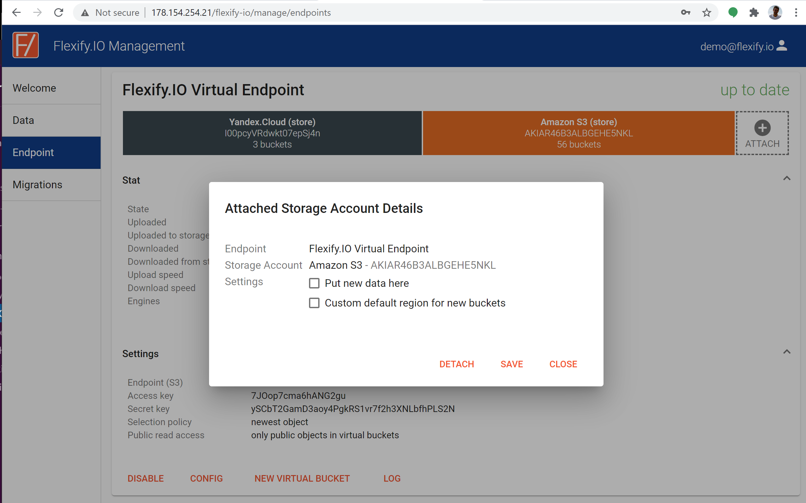
 Now, new data will only be saved to Yandex.Cloud Object Storage.

### Virtual Buckets

Bucket names must be unique and you may not be able to create a bucket with the name you want in one or more clouds. You can use Flexify.IO to map bucket names with the help of virtual buckets.

To create a new virtual bucket, click **New Virtual Bucket** on the Endpoint card and enter a name for the virtual bucket. You can then attach multiple buckets to the virtual bucket and make all objects from the attached buckets available via the virtual bucket.

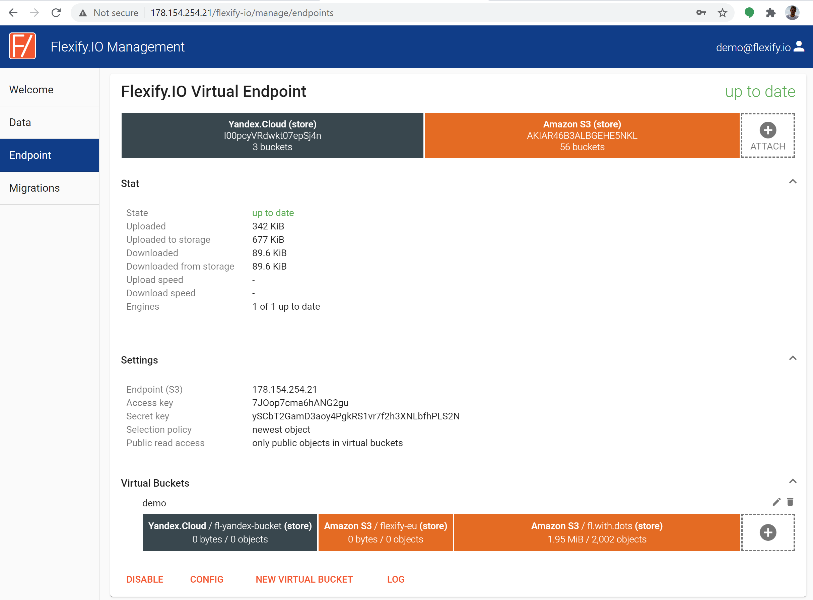

### 
Virtual buckets also let you combine data from multiple buckets on the same cloud provider. 
## Scaling out

The Flexify.IO virtual machine image from Yandex.Cloud Marketplace is a powerful solution for multi-cloud storage and cloud data migration. However, it's limited to a single virtual machine. Thus, horizontal scalability and fault tolerance options are limited. 

If you'd like to deploy Flexify.IO in a true cloud-native fashion with several horizontally-scalable, stateless, and centrally controlled Flexify.IO engines, please contact us for installation instructions.
