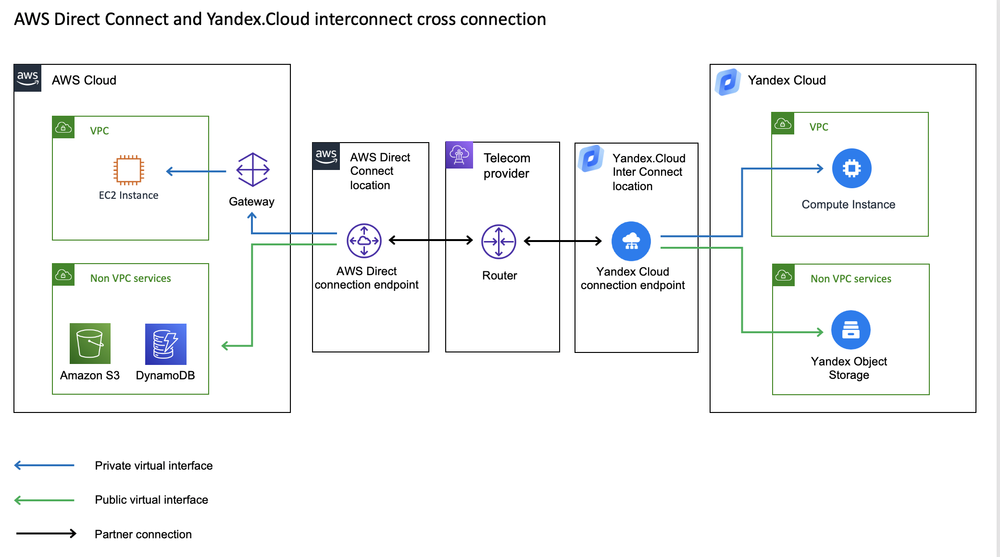

# Establish Private link between AWS VPC and Yandex.Cloud
AWS and Yandex Cloud have ability to establish Direct connection between clouds and traverse traffic trhough private connection instead of using internet. That could help to archieve these things:
* Increase security of the connection
* Reduce traffic cost
* Increase network performance and realibility of the connection.   

You can find more details about (AWS Direct Connect)[https://docs.aws.amazon.com/directconnect/latest/UserGuide/Welcome.html] and (Yandex.Cloud InterConnect)[https://cloud.yandex.com/docs/vpc/interconnect/].

## High level diagram
Below you can find a high level diagram of private connection between AWS and Yandex.Cloud through 3rd party partner telecom provider 

To sussfully establish connection you will need to do configuration in both cloud consoles and work with partner that could establish connectivity physical connectivity. 

## Configuration steps
To establish connectivity you will need active AWS account and Yandex.Cloud account.

1. Go to AWS console to (https://console.aws.amazon.com/directconnect/v2/home)[https://console.aws.amazon.com/directconnect/v2/home] 
2. Create connection. (Here)[https://docs.aws.amazon.com/directconnect/latest/UserGuide/create-connection.html] you can find detailed instruction  
3. Download the LOA-CFA document. (detailed steps)[https://docs.aws.amazon.com/directconnect/latest/UserGuide/create-connection.html#create-connection-loa-cfa]
4. Provide that document to the partner that will create physical connection. the list of partner you can find below
5. Go to Yandex.Cloud console and create support request ticket to request InterConnect. The request must indicate the point of presence where the connection is set up and the connection bandwidth. If you set up a connection via a partner, enter the name of the partner company. (Here)[https://cloud.yandex.com/docs/vpc/interconnect/] you can find more deatils.
6. After that support will comeback to you and help establish configuration.
7. You can monitor status of you connection in AWS console in "connection" section.
8. When the connection would be established you will need create Virtual Interfaces in AWS console. (Here)[https://docs.aws.amazon.com/directconnect/latest/UserGuide/WorkingWithVirtualInterfaces.html] you can find more detaild of how to do that.

## Partners 
We found that these partners could help and previosly have experience to establish such connectivity:
1. Retn
2. LinxDataCenter
3. xxx

https://aws.amazon.com/directconnect/partners/
