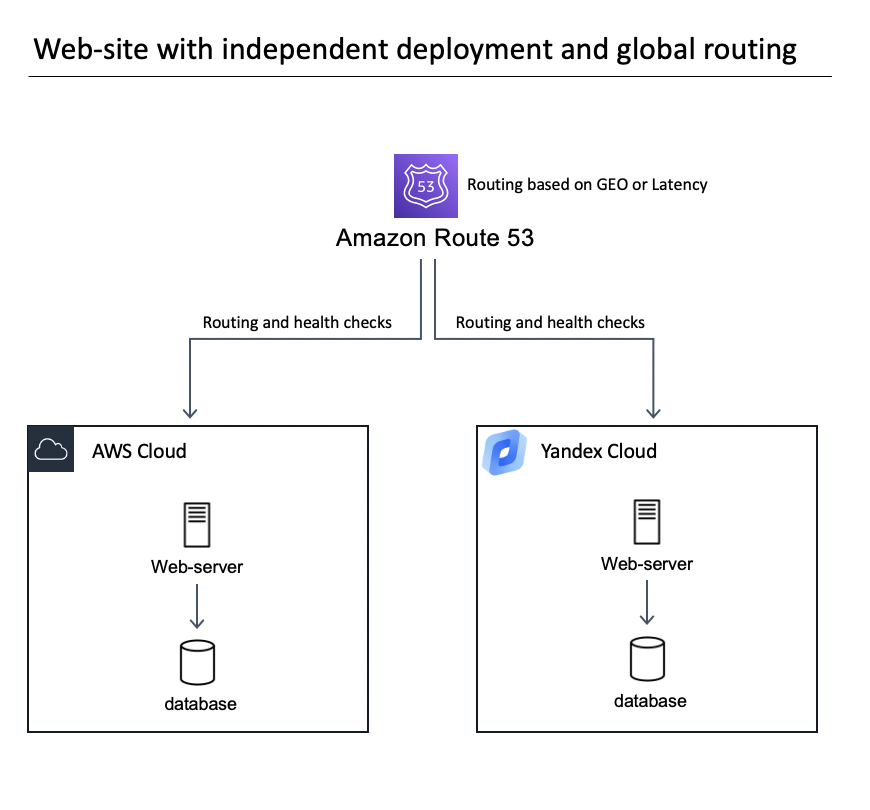
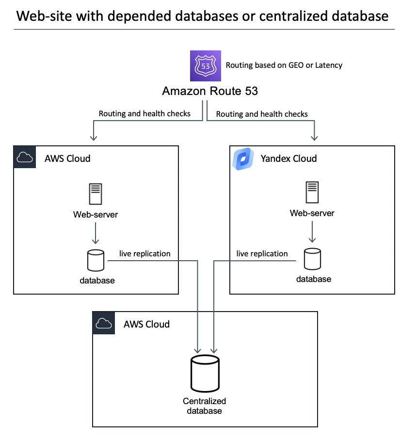
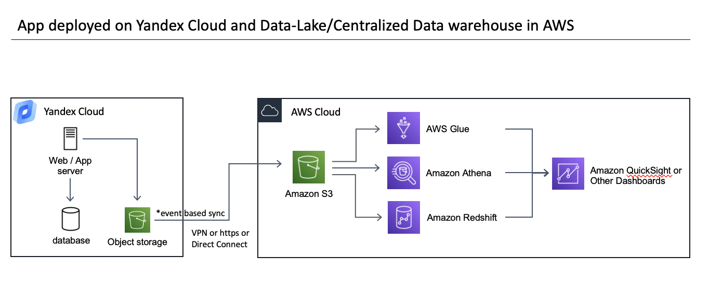
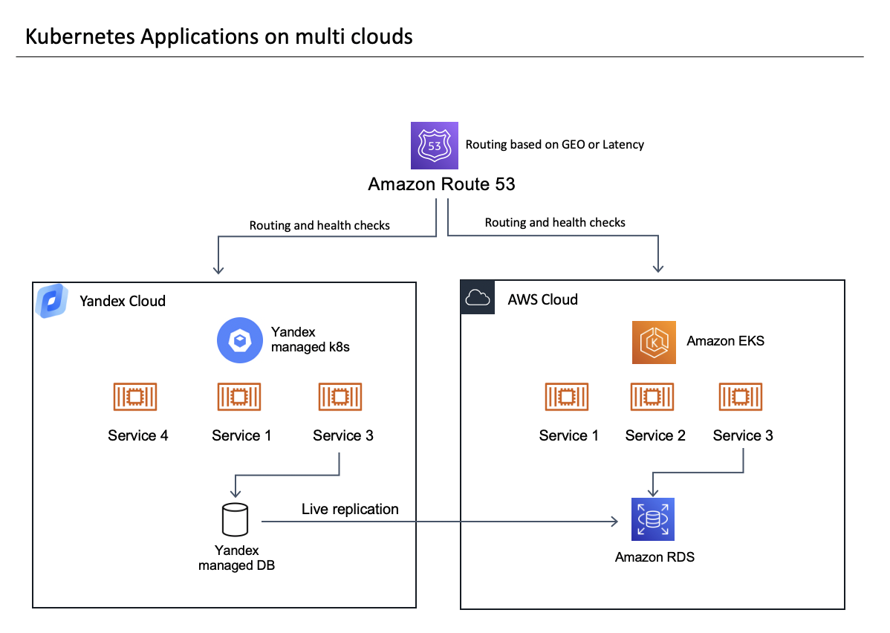
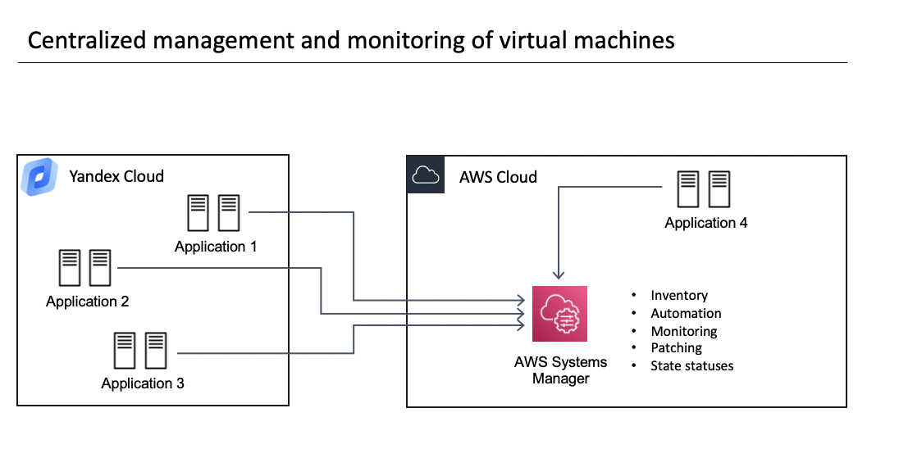

# Yandex.cloud and AWS integration pack
This repository contains a number of base blocks that will help developers and DevOps engineers build hybrid solutions between clouds. We tried to identify the most common tasks that developers encounter while architecting or developing solutions, described the best practices, and provided examples of automation using Terraform for building blocks. The repository contains descriptions of common scenarios and consists of the following modules:
1. <a href="/VPN/README.md">Automation for a VPN between Yandex.Cloud and AWS</a>
2. <a href="/Database replication/README.md">Example of database replication between managed PostgreSQL and RDS using logical replication</a>
3. <a href="/Kubernetes and route53/README.md)">Example of Kubernetes deployment between clouds and traffic routing using a global DNS</a>
4. <a href="/s3 Sync/README.md">Example of syncing Yandex Object Storage and AWS S3 using Lambda functions</a>
5. <a href="/Multi-cloud S3 storage/README.md">Guide for establishing multi cloud S3-compatible storage that distributes data between two clouds</a>
6. <a href="/System Manager (hybrid instance management)/README.MD">Example and automation for managing instances on Yandex.Cloud using AWS Systems Manager</a>
7. <a href="/Private link between AWS and Yandex/README.md">Guide for establishing a direct connection or private link between clouds</a>
8. <a href="/DynamoDB and YDB/README.md">Guide for writing an application on Yandex.Cloud that is compatible with AWS DynamoDB</a>

We are always open to new ideas for adding blocks to the repository. If you think we missed something, please contact us and describe your scenario in the GitHub repository under Issues.

## Why we did it
We’ve observed more and more customers using cloud technology for a wide variety of reasons. For example:
1. A Russian company that wants to start working with customers outside Russia and increase the quality of their services by deploying additional services via other cloud providers. This might be a game studio where latency is important, an ecommerce website, or a number of other situations.
2. Companies that want to start operating in Russia and increase the quality of their services or comply with the federal laws on private data.

To address these scenarios, we decided to implement best practices and automation techniques to help bootstrap development and deployment. Below you’ll find some common architecture patterns that can be developed using the integration block examples in this repository, among other things.

### **Website with independent deployment and global routing**
This is an example of a website that works independently on both clouds to be closer to end users and compliant with local private data laws and regulations. Routing is established by a global DNS via Amazon Route 53, which can route users based on their location or latency.

    

An example of setting up Route 53 between Yandex.Cloud and AWS can be found [here](link)

### **Website with dependent or centralized databases**
This is a more advanced scenario that requires you to collect data in a centralized location for further analysis or analytics.

    

Examples to help build this architecture:

* <a href="/Database replication/README.md">Setting up replication between databases based on PostgreSQL.</a>

* <a href="/VPN/README.md">Establishing a VPN connection for more secure connectivity.</a>

* <a href="/Private link between AWS and Yandex/README.md">Establishing Direct Connect.</a>

### **Centralized data warehouse on AWS and app deployment on Yandex.Cloud**
Another common scenario is creating a data lake on AWS. Your website or application can operate in different countries and regions and on different cloud providers, but you need to collect all the information from distributed locations in one place. Below is an example of how that can be done. Data without personalized attributes is created on the Yandex.Cloud side and written to object storage, which is located physically within the country. Object storage then triggers a Yandex function, which uploads the object to the centralized object storage on AWS.  

    

Examples to help build this architecture:

* <a href="/s3 Sync/README.md">Yandex function that syncs data between clouds.</a>

* <a href="/VPN/README.md">Establishing a VPN connection for more secure connectivity.</a>

### **Kubernetes applications on multi clouds**
Kubernetes is an extremely popular technology for building apps. This scenario shows how you can build a distributed app based on Kubernetes. The state of the app in the database can be synced. You can also enhance this architecture using KubeFed or Istio to establish a federation of Kubernetes resources between clusters.    

    

Examples to help build this architecture:

* [Kubernetes deployment between clouds and traffic routing using global DNS.](link)

* <a href="/Database replication/README.md">Setting up replication between databases based on PostgreSQL.</a> 

* <a href="/VPN/README.md">Establishing a VPN connection for more secure connectivity.</a>

* <a href="https://github.com/kubernetes-sigs/kubefed">KubeFed examples.</a>

### **Centralized virtual machine fleet management**
In some cases, apps can work completely independently and you don’t need to sync states or data between deployment sites. However, you still need to operate and manage these apps and virtual machines. Management tasks include:
* Patching
* Monitoring
* Access control
* Inventory management

    

Examples to help build this architecture:

* <a href="/System Manager (hybrid instance management)/README.MD">Example and automation for managing instances on Yandex.Cloud using AWS Systems Manager.</a>

* <a href="/VPN/README.md">Establishing a VPN connection for more secure connectivity.</a>

 

## Customer stories or examples

