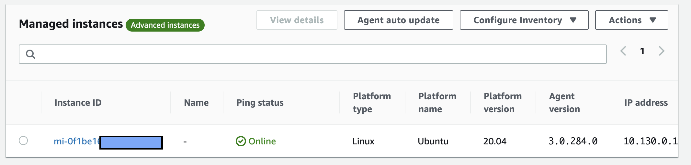

# AWS Systems Manager for Hybrid managed instances
Systems Manager provides a unified user interface so you can view operational data from multiple managed instances across AWS, on-premise and other cloud providers and allows you to automate operational tasks across your resources. With Systems Manager, you can group resources, view operational data for monitoring and troubleshooting, and take action on your groups of resources. Systems Manager simplifies resource and application management, shortens the time to detect and resolve operational problems, and makes it easy to operate and manage your infrastructure securely at scale.

Systems Manager securely communicates with a lightweight agent installed on your servers to execute management tasks. This helps you manage resources for Windows and Linux operating systems running on Amazon EC2, on-premises and other cloud providers. [Here](https://docs.aws.amazon.com/systems-manager/latest/userguide/what-is-systems-manager.html) you can read more about that service.

Configuring your hybrid environment for Systems Manager enables you to do the following:
* Create a consistent and secure way to remotely manage your hybrid workloads from one location using the same tools or scripts.
* Centralize access control for actions that can be performed on your servers and VMs by using AWS Identity and Access Management (IAM).
* Centralize auditing and your view into the actions performed on your servers and VMs by recording all actions in AWS CloudTrail.
* For information about using CloudTrail to monitor Systems Manager actions, see Logging AWS Systems Manager API calls with AWS CloudTrail.
* Centralize monitoring by configuring EventBridge and Amazon SNS to send notifications about service execution success.


# Configuration 
To start managing your instances that deployed on Yandex.Cloud you will need first provision roles and make Activation session with keys to help with that you can find a script: `initial_setup.sh` that will provision a IaM role for SSM and attach requered permissions. Also it will generate Activation Key and ID that should be used on managed instances during configuration.

## Initial setup
Run that script from terminal where you have install [AWS CLI](https://docs.aws.amazon.com/cli/latest/userguide/install-cliv2.html) with configured credentials. 

```
./initial_setup.sh
```

you will get the output like that, please store these keys in secured place because you will use it during configuring ssm agents:

```
{
    "ActivationId": "27eb21d4-8611-4dee-8fd3-dc664b305773",
    "ActivationCode": "9a0Ls7VhsffdfDHxxxsqge"
}
```

## Addinig Virtual Machine to SSM
To add instance to SSM inventory you will need to run the script with Activation code and ID on machines.

For Linux (Ubuntu) use:

```
./agent_install_ubuntu.sh {Activation Code} {Activation ID}
```

For RHEL and CentOS use:

```
./agent_install_RHEL_CentOS.sh {Activation Code} {Activation ID}
```

For Windows use (with elevated permissions):

```
agent_install_windows.ps1 {Activation Code} {Activation ID}
```

## Checking instances status in AWS Console
To check the status of machines and manage them:
1. Go to [SSM console](https://eu-central-1.console.aws.amazon.com/systems-manager/)
2. Go to [Managed Instances](https://eu-central-1.console.aws.amazon.com/systems-manager/managed-instances?region=eu-central-1)
3. You should see something like that 
