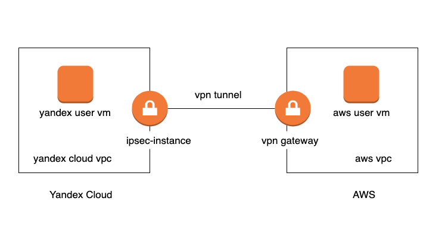

# Setting up VPN between AWS VPC  and Yandex VPC

## Overview and target scenario 
Sometimes you need to deploy VPN Site-To-Site connection between Yandex and VPN.You can use this example and module to set  it up.





Lets follow the example to see how its works

## Prerequisites

- Accounts in AWS and Yandex.Cloud
- Bash
- Terraform 
- jq

To configre AWS Site
- Configure [AWS CLI](https://docs.aws.amazon.com/cli/latest/userguide/cli-chap-configure.html) 
To configure Yandex.Cloud part
- Configure  [YC CLI](https://cloud.yandex.com/docs/cli/quickstart) 
- Export Yandex Cloud Credentials for Provider
```
export YC_TOKEN=$(yc config get token)
export YC_CLOUD_ID=$(yc config get cloud-id)
export YC_FOLDER_ID=$(yc config get folder-id)
```

## Quick start


### Initiate example playbook.  


Please note that it uses "~/.ssh/id_rsa.pub" path for your public key. 

```
cd example
terraform init
terraform apply # use -var=public_key_path='another_path_to_ssh_public_key' if you your ssh key is located somewhere else
```

### Wait for about 10 Minites...

Then you should be able to login to user vms with your ssh key  and ping private ip addresses of each other


### Ping from AWS to Yandex

Use following commands 

```bash
YC_VM_ADDRESS=$(terraform output yandex_vm_internal_ip_address)
ssh admin@$(terraform output aws_vm_external_ip_address) "ping $YC_VM_ADDRESS -c 2"
```
You should see
```
Warning: Permanently added '54.244.68.241' (ECDSA) to the list of known hosts.
PING 10.10.0.28 (10.10.0.28) 56(84) bytes of data.
64 bytes from 10.10.0.28: icmp_seq=1 ttl=62 time=213 ms
64 bytes from 10.10.0.28: icmp_seq=2 ttl=62 time=203 ms

--- 10.10.0.28 ping statistics ---
2 packets transmitted, 2 received, 0% packet loss, time 1001ms
rtt min/avg/max/mdev = 203.462/208.306/213.150/4.844 ms
nrkk-osx:example nrkk$ 
```

### Ping from Yandex to AWS

Use following commands 

```bash
AWS_VM_ADDRESS=$(terraform output aws_vm_internal_ip_address)
ssh admin@$(terraform output yandex_vm_external_ip_address) "ping $AWS_VM_ADDRESS -c 2"
```
You should see
```
Warning: Permanently added '178.154.225.171' (ECDSA) to the list of known hosts.
PING 10.250.0.45 (10.250.0.45) 56(84) bytes of data.
From 10.10.0.10: icmp_seq=1 Redirect Host(New nexthop: 10.10.0.1)
64 bytes from 10.250.0.45: icmp_seq=1 ttl=62 time=203 ms
64 bytes from 10.250.0.45: icmp_seq=2 ttl=62 time=203 ms

--- 10.250.0.45 ping statistics ---
2 packets transmitted, 2 received, 0% packet loss, time 1001ms
rtt min/avg/max/mdev = 203.688/203.689/203.691/0.451 ms
nrkk-osx:example nrkk$ 
```

### To destroy everything quickly


```bash
terraform destroy
```