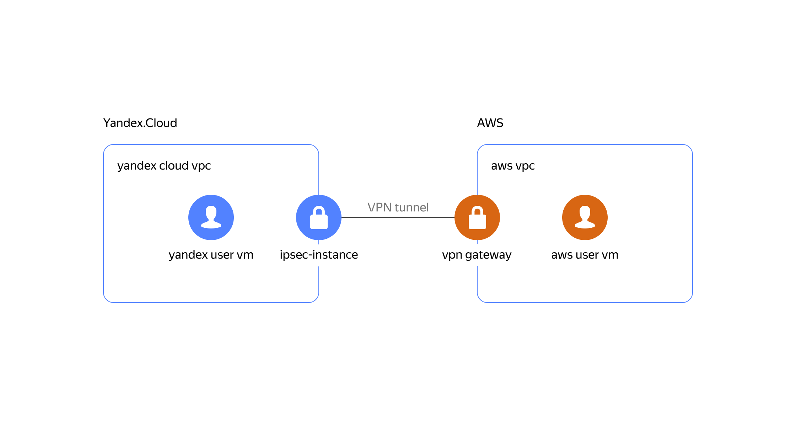

# Setting up a VPN between AWS VPC and Yandex VPC

## Overview and target scenario
If you need to deploy a Site-to-Site VPN connection between Yandex and a VPN, you can use this example and module to set it up.


<p align="center">
    
</p>


Let’s look at an example to see how it works.

## Prerequisites

- Accounts in AWS and Yandex Cloud
- Bash
- Terraform 1.1.5
- jq

Configure the AWS site:
- Configure the [AWS CLI](https://docs.aws.amazon.com/cli/latest/userguide/cli-chap-configure.html)

Configure Yandex Cloud:
- Configure the [YC CLI](https://cloud.yandex.com/docs/cli/quickstart)
- Export Yandex Cloud configuration data for the Terraform provider:
```
export YC_TOKEN=$(yc iam create-token)
export YC_CLOUD_ID=$(yc config get cloud-id)
export YC_FOLDER_ID=$(yc config get folder-id)
```

## Quick start

### Initiate an example playbook  

Please note that this uses the path "~/.ssh/id_rsa.pub" for public keys: 

```
cd example
terraform init
terraform apply # use -var=public_key_path='another_path_to_ssh_public_key' if your ssh key is located somewhere else
```

### Wait about 10 minutes

Afterwards, you should be able to log in to the user’s virtual machines with your SSH key and ping private IP addresses.

### Ping from AWS to Yandex

Run the following commands:

```bash
YC_VM_IP=$(terraform output -raw yandex_vm_internal_ip_address)
ssh admin@$(terraform output -raw aws_vm_external_ip_address) "ping $YC_VM_IP -c 2"
```
The output should look something like this:
```
Warning: Permanently added '54.244.68.241' (ECDSA) to the list of known hosts.
PING 10.10.0.28 (10.10.0.28) 56(84) bytes of data.
64 bytes from 10.10.0.28: icmp_seq=1 ttl=62 time=213 ms
64 bytes from 10.10.0.28: icmp_seq=2 ttl=62 time=203 ms

--- 10.10.0.28 ping statistics ---
2 packets transmitted, 2 received, 0% packet loss, time 1001ms
rtt min/avg/max/mdev = 203.462/208.306/213.150/4.844 ms
```

### Ping from Yandex to AWS

Run the following commands:

```bash
AWS_VM_IP=$(terraform output -raw aws_vm_internal_ip_address)
ssh admin@$(terraform output -raw yandex_vm_external_ip_address) "ping $AWS_VM_IP -c 2"
```
The output should look something like this:
```
Warning: Permanently added '178.154.225.171' (ECDSA) to the list of known hosts.
PING 10.250.0.45 (10.250.0.45) 56(84) bytes of data.
From 10.10.0.10: icmp_seq=1 Redirect Host(New nexthop: 10.10.0.1)
64 bytes from 10.250.0.45: icmp_seq=1 ttl=62 time=203 ms
64 bytes from 10.250.0.45: icmp_seq=2 ttl=62 time=203 ms

--- 10.250.0.45 ping statistics ---
2 packets transmitted, 2 received, 0% packet loss, time 1001ms
rtt min/avg/max/mdev = 203.688/203.689/203.691/0.451 ms
```

### Destroy everything quickly

```bash
terraform destroy
```
